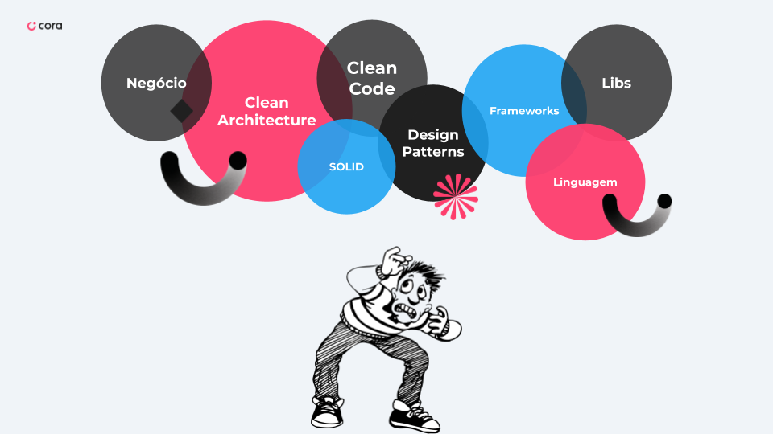
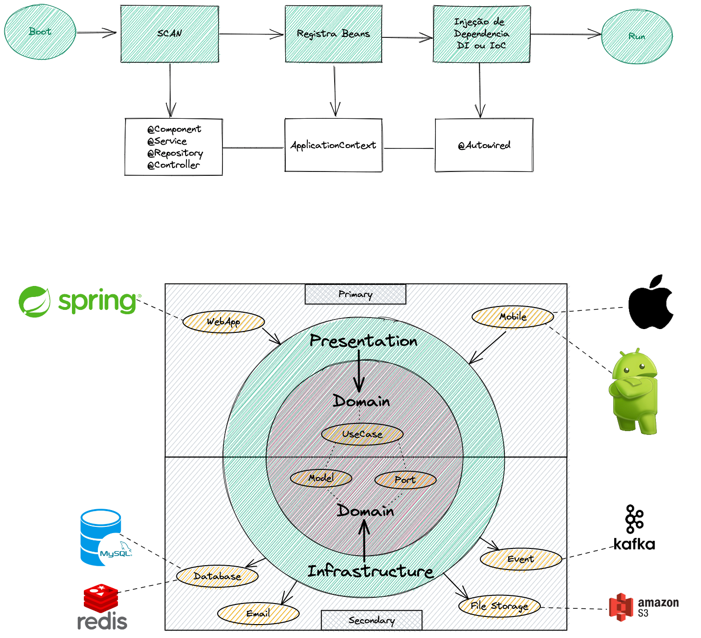
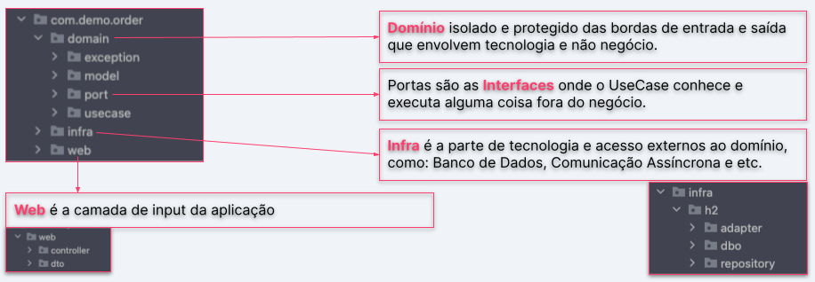

# TDC 2022
Projeto de exemplo para a Talk do TDC 2022

**Tema**: Como desacoplar componentes aplicando DI e IoC com Spring e Kotlin

> A evolução do projeto ficou documentada através de `branches` e você pode ver desde a primeira onde está o problema do acoplamento e ir navegando nas próximas `branches` para saber como foi evoluindo o refactor.  

- [Muitos conceitos](#so-tantos-conceitos)
- [Spring e Hexagonal](#spring-e-hexagonal)
- [Estrutura](#estrutura)

## São tantos conceitos 

## Spring e Hexagonal

## Estrutura

